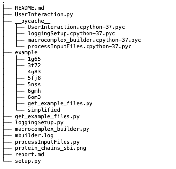

# Macrocomplex Builder
Macrocomplex Builder is a standalone `python3` application developed by **Annika Meert**, **Elena Pareja Lorente** and **Paula Torren Peraire**. The purpose is to model the macro-complex (quaternary) structure of biomolecules, formed by proteins and nucleotids or only proteins given a folder with the structures of protein-protein and protein-DNA/RNA interactions in PDB format. 
##Index


- [Requirements](#Requirements)
- [Installation](#Installation)
- [Package Structure](#Structure-of-the-Package)
- [Tutorial](#Tutorial)
- [FAQS](#FAQS)


## Requirements
For using Macrocomplex Builder, there are some requirements:

* [Python 3](https://www.python.org/)

**Third-party packages**

It was used several python modules for the tool development. These modules can be found in [PyPI](https://pypi.org/). 

* [biopython](https://pypi.org/project/biopython/)
* [numpy](https://pypi.org/project/numpy/)

## Installation

To use the tool, the user first has to download the package from Git and then install it via `setup.py` in the python site-packages.

 ```bash
 $ git clone https://github.com/anmeert/sbi-project.git
 $ cd sbi-project
 $ sudo python3 setup.py install
 ``` 
## Structure of the Package
The package has been structured as follows:
<!--ASK ANNI, MAYBE THERE IS A BETTER WAY-->



* `Complex.py`:
* `README.md`: 
* `report.md`:
* `get_example_files.py`:
* `InteractingChain.py`:
* `Interaction.py`
* `UserInteraction.py`:
* `macrocomplex_builder.py`:
* `setup.py`: To install the package.


## Tutorial

In this section, an explanation of how to run the script from the command line and what are the required and optional arguments is provided. 

The simples way to run it:

 ```bash
 cd scr/
 $ macrocomplex_builder.py
 ```
In this case, it will run using the current folder as input and it will produce as an output a file named macrocomplex.pdb in the same folder. 

Input and output can also be specified (using `-i`and `-o` arguments). The input can be a folder with the interaction in pdb format and the sequences in fasta format or all the files to be used.
 
 ```bash
 $ macrocomplex_builder.py -i /path/pdb/fasta/folder -o /final/path/complex_name.pdb
 
 $ macrocomplex_builder.py -i /path/pdb/file.pdb /path/fasta/file.fasta -o /final/path/complex_name.pdb
 ```
Another option is to indicate the maximum number of strings that the user wants to add to the final complex. This number of strings may not be reached if it is not possible to add more strings due to stereo impediments. 

 ```bash
 $ macrocomplex_builder.py -i /path/pdb/fasta/folder -l 30
 ```
The user can also indicate the stoichiometry of the complex in a specific format:

 ```bash
 $ macrocomplex_builder.py -i /path/pdb/fasta/folder -s A3B5C8
 ```

There are two run types: simple and complete. By default, it runs simply because it is less computationally expensive and gives quite good results. If the user would like to explore all the different possibilities the `-c` argument can be used (see report for more information about simple and complete algorithms). 

 ```bash
 $ macrocomplex_builder.py -i /path/pdb/fasta/folder -c
 ```
If the user wants to follow the program progression, verbose option `-v` will print the progression log and warnings in the standard output. By default, warnings are printed in the `log file`. 

 ```bash
 $ macrocomplex_builder.py -i /path/pdb/fasta/folder -v
 ```

Use `-h` to get information about all the arguments: 

```bash
 $ macrocomplex_builder.py -h 
# WHEN THE HELP IS DONE, COPY HERE  
```

## FAQS
* **What is the maximum number of chains that can be modelled?** The program can build models with no limit of chains, the problem is that it can only print 52 chains. Therefore, the maximum number of chains that the generated complex can contain is 52.
* **Can the algorithm handle with heteroatoms?** Yes, if the pdb inputs contain heteroatoms, these will be represented in the final complex.
* **Can the algorithm handle with different subunits?** Yes, as long as the coordinates of the interaction pairs are the same coordinates of the final complex. 


