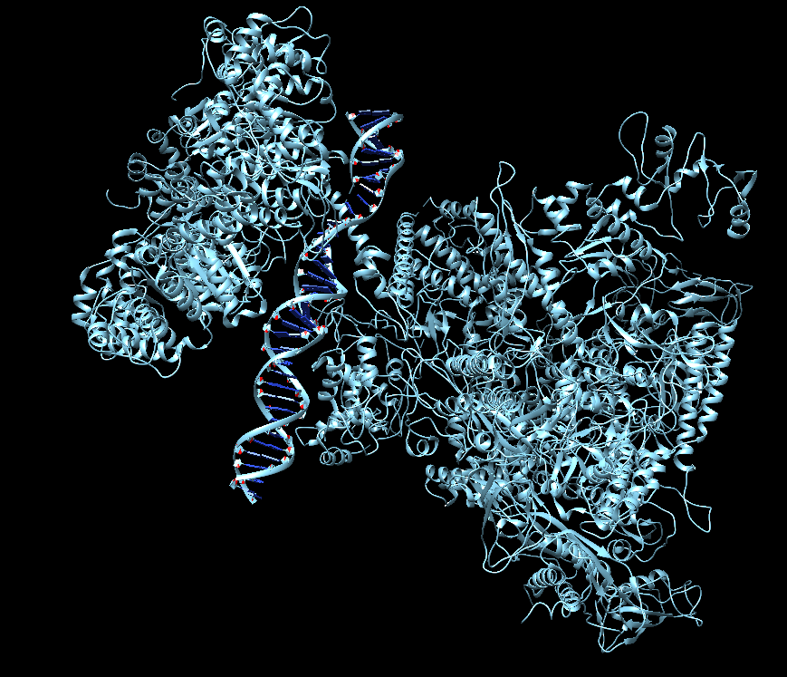
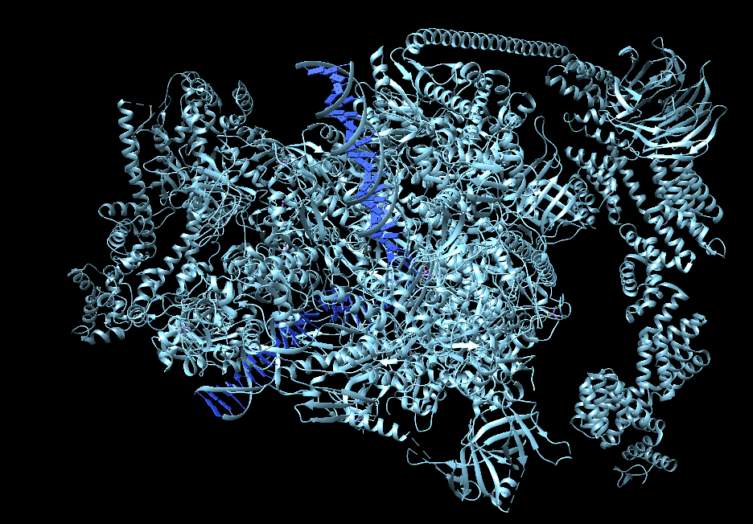
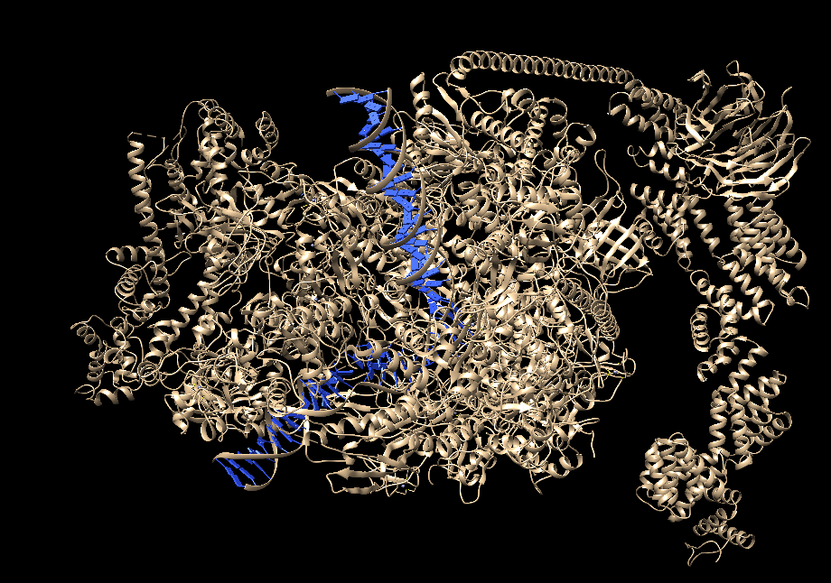
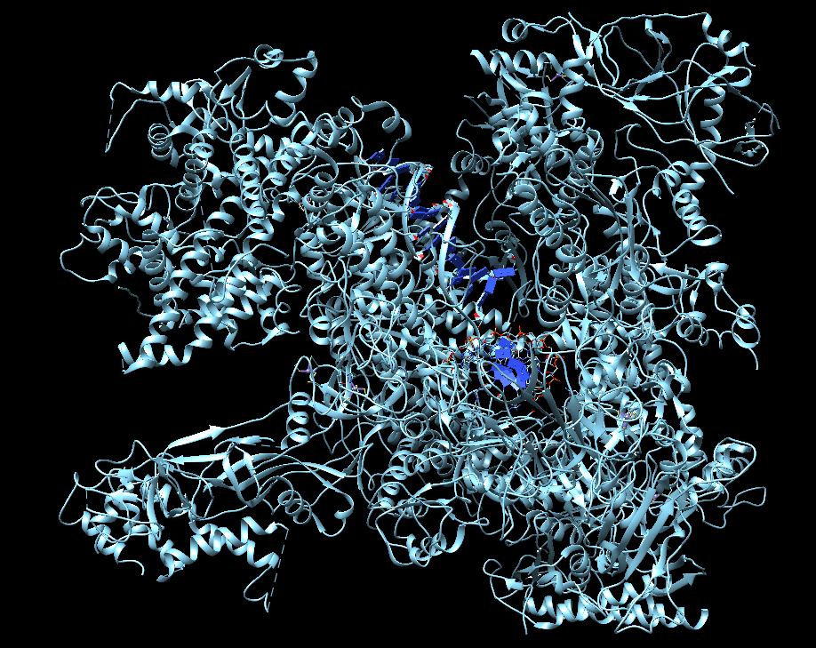
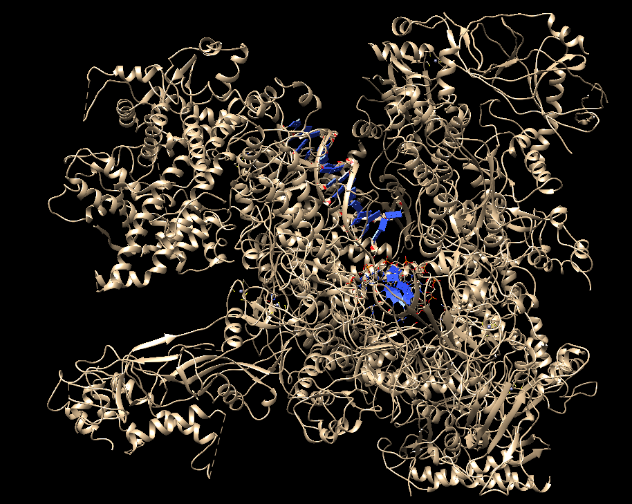
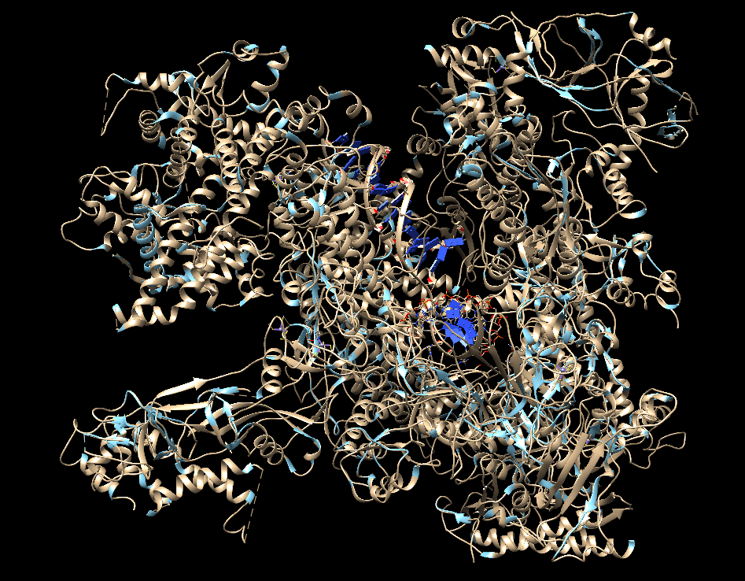
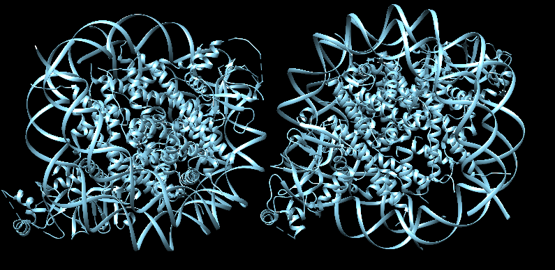
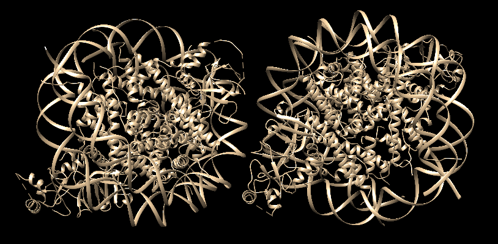
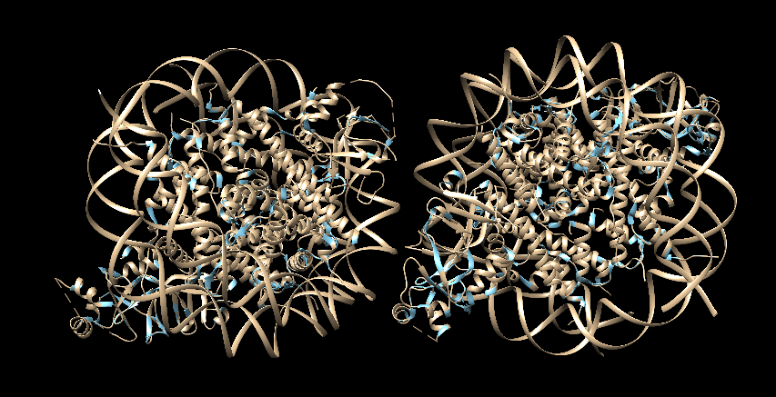

# SBI + PYT project
*by Annika Meert, Elena Pareja Lorente and Paula Torren Peraire*

## Index
<!-- TOC depthFrom:1 depthTo:7 withLinks:1 updateOnSave:1 orderedList:0 -->
- [Introduction](#Introduction)
- [Background and Scientific Explanation](#Background-and-Scientific-explanation)
- [Algorithm](#Algorithm)
- [Examples Analysis](#Examples-Analysis)
- [Further Steps](#Further Steps)
<!-- /TOC -->

## Introduction

Due to the importance of knowing the structure of Protein-Protein Interactions (PPIs) in the cell, the goal of this project is to perform an algorithm to model a protein macro-complex from individual pairs of interactions using Bioinformatics resources.

## Background and Scientific Explanation

Proteins are versatile molecules that play many critical roles in the body. Individual proteins are capable of producing a large variety of protein complexes, or even complexes with other molecules, such as DNA, that allow them to perform their function. These complexes are known as the quaternary structures of proteins; they are the spatial arrangement of chains as well as any interactions among them, be they covalent or non-covalent. Complex structures modulate the biological activity of the protein, and the separation of the subunits often leads to the loss of functionality.

Experimentally determining the full structure of a protein complex or quaternary structure is very costly and time-consuming. Therefore, it is essential to develop effective computational techniques that combine experimental information and data obtained from high-throughput methods to model the protein complexes.

## Background and Scientific Explanation

To be able to create these macrocomplexes, we require a starting point composed of Protein DataBank (PDB) files which feature experimentally determined structures. In our case, these structures are the combination of chains within our complex. As mentioned, experimentally determining the structure of a complex is problematic and so a suitable alternative is determining the physical structure of sections of the complex, i.e. the protein-protein interactions between two chains within these complex.

The core of our program is based on superimposition; if there are sufficient PDB files, we can superimpose these and build a much more complex quarternary structure, modelling any interactions which the experimentally obtained PDB files may not show.

Superimposition aligns two protein chains such that their carbon backbones lie one on top of the other as much as possible, where one chain is fixed, and the other is rotated and translocated to minimise their separation. Though secondary structure can easily be different between distant homologs, their tertiary structure is more conserved, and so homology can be more readily ascertained from this level. Despite this, structure homology is more costly to produce compared to sequence homology. Though structure homology may be better at identifying distant homologs, sequence homology may be used to curb the number of superimposition that need to be carried out.

In this program, we establish superimposition to implement new proteins onto the macrocomplex. If two chains have a low RMSD (root-mean-square deviation), we can determine that they are homologous chains and so interactions in the individual PDB files can be combined to give a broader image of the macrocomplex. The superimposition is carried out using alpha carbons since these make up the rigid backbone. The lower the RMSD of a superimposition, the more similar the structures are considered to be.

Moreover, an accurate superimposition does not imply that a third chain is in that location. To be able to confirm whether a particular chain should be added to the macrocomplex, it is also essential to check its surrounding chains and whether there are any steric clashes. These could lead to unnatural structures in the model, produced by non-bonding atoms being places together or two atoms being at too close a distance. Even though two chains superimpose correctly, the chain with which it is interacting may occupy the space of a protein that is already there; this means that the interacting chains should not be placed in the complex, in that location.


To judge the presence of steric clashes VanDerWaals radius is used, any atom from a different chain that is within a 1.7 angstrong radius of an alpha carbon is denoted as a clash; this distance is chosen since it corresponds to carbons' VdW radius. There are several non-covalent bonds found in proteins, such as hydrogen bonding; these types of interactions mean that the distance between two nuclei may be reduced, only the alpha carbon radii are measured to reduce the impact of this effect.

Once a complex has been built, its interface can give information regarding if it is a suitable conformation. In general, hydrophobic residues face towards the centre of the complex, though specific interactions such as those with small molecules may change this. This property of proteins means that models can be assessed to check whether they are natural. Moreover, homology can be used to check the likelihood of the model by identifying domains or structurally similar protein complexes.

Finally, PDB files often only have a part of the protein structure and so we can rebuild the complete quaternary structure by using the relevant amino acid sequences from FASTA files to build-out our model of the structure.

## Algorithm

Once we have run quality control through the input, assuring that the files introduced are either PDB or FASTA file formats, we can initiate the main bulk of the algorithm. Firstly, chains from each PDB are built into their corresponding sequences (be they Protein, DNA or RNA). At this point, we perform pairwise sequence alignment where each chain from a PDB file is aligned with another chain from a different file. This alignment is carried out to identify homologous chains. In our algorithm, we consider homology to be sequences that have more than 95% identify. These homologous chains are set up into the pertinent structure.

Once we have our input data processed, we set the starting complex. The staring complex is selected by identifying the PDB file with the greatest number of homologous chains. By using this, it initiates the run with a PDB file which includes the most significant number of interactions possible, thus increasing the likelihood of obtaining a complete model.

At this point, the program can run two different types of algorithms depending on which the user has chosen, `simple` or `complete`.  

#### Simple
`Simple` is the default run type option. The program iterates through each chain in the current complex, from here on this chain is referred to as _Chain A_; initially, the current complex is the starting interaction mentioned above. It attempts to superimpose chains that are homologous to _Chain A_ and checks for clashes in those superimpositions where RMSD is lower than previously tested homologous chains. Eventually, this returns a single optimal chain to add to the complex (that with the best RMSD and not clashing with other chains currently in the complex). With the addition of this chain, a new `option_complex` is stored, and the iteration continues, this time using the `option_complex` and carrying out the same procedure for the next chain within the initial complex (referred to as `current_complex`). This process advances until all the chains in the initial complex are analysed. As many chains as there are chains in the current complex can be added at the end of this loop. At this point, the program checks whether any end criteria is met. If this is the case, it returns the final complex. If these criteria have not yet been reached, then the program reruns the algorithm to continue adding chains to the complex. In each iteration all chains are checked, new chains which may have been initially discarded due to higher RMSD may be placed at that very location if the additional criteria are met.

#### Complete
Functions used in this type of run are the same as those in `Simple` but with some notable procedural differences. The run loops through any chains that may be superimposed onto the current complex. For each of these, it checks where the chain may be superimposed within the current complex, it then searches for alternatives to this chain (i.e. homologous chains). For each of these homologous chains, it examines which chain has the best RMSD and no clashes. The chain is added to the complex and, if end criteria have not been met, the program runs recursively. Therefore the algorithm is exhausting all possible options for the model and not only depending on the RMSD value. This type of run produces a much larger number of models, but since all options have been exhaustively tested, there is greater accuracy.

|   |   |
|--- |---|

### Superimposition
For each chain that is introduced into the `superimpose` function the program checks which chains are homologous to it. The program then iterates through these homologous chains and superimposes them each onto the chain introduced into the function. Considering a default RMSD threshold of 0.5, the newly calculated RMSD is evaluated to consider whether it is lower than the RMSD from previously tested homologous chains. If RMSD is lower,  the program goes go on to check for clashes.

The default RMSD can be changed, reducing the value means that fewer chains are tested for clashes, possibly missing a chain in the complex. If the RMSD is raised, then chains in later rounds of the iteration may be tested, leading to higher computational time and the possibility of bad superimpositions being considered as chains to add.

### Steric Clashes
Steric clashes are checked using the `Complex` class function `is_clashing`. The function requires the interacting chain of the previously superimposed chain. A list of alpha carbons is produced for both the chain being tested and the current model. With these, it checks whether any of the chains' alpha carbons are within a 1.7 angstrong radius of the alpha carbons from the current complex. If there are more than 3% of chain atoms within this radius, then the chain is returned to the `Superimpose` function as `True` (i.e. the chain is clashing). If there are fewer clashes than this threshold, the chain is considered not clashing.

If a chain is considered not clashing, then it is added to the `Model` object of the current complex.

### End criteria and Subunits
There are three end criteria in place:
- No chains able to be added
- Stoichiometry reached
- Limit number of proteins reached
In the latter cases, the `create_macrocomplex` function returns the complex. In the former, another condition is introduced, if no chains can be added to the complex the program checks whether all the PDB interactions initially introduced are present in the PDB. These have been marked using a boolean during the progress of the algorithm. In the case that all interactions are present, then it returns the complex. But, if some chains are marked as False, then the algorithm evaluates the complex. It produces a list of all remaining chains (chains inputted but not in the current complex) and identifies the chain with the greatest number of interactions (same procedure as selecting the starting complex). It is checked whether this chain has any clashes with the current complex and if not the `create_macrocomplex` function is called again to continue building the complex since there may be missing subunits.


## Examples Analysis

In this section complexes built using Macrocomplex builder are analysed, along with the necessary commands used to build them with the files in the `example` folder. In addition, there is a discussion of how the program performs in terms of running time and complex quality.

In the images, the <span style="color:blue;"> **blue complex**</span> is the experimentally-determined complex and the <span style="color:#FBDAB0;"> **beige complex** </span> is the modelled complex.

### Example 1 ([4g83](https://www.rcsb.org/structure/4g83))
This PDB entry corresponds to the crystal structure of p73 DNA-Binding domain tetramer from *Homo Sapiens*, bound to a full response-element. This entry is formed by 1 unique protein chain and 1 unique nucleic acid chain.

The program is able to create this complex of 4 chains with 5 files very quickly, therefore, it can handle redundant interactions.

  

As can be seen, the model built fits perfectly with the original complex, there is no differences between them. So the program has no problem dealing with this type of interactions. This model was built using default options and adding stoichiometry as an example.

Not all chains need to be introduced in the stoichiometry option, instead, the program evaluates homologous chains within the complex. Therefore if a partial stoichiometry is introduced, the program can apply this to the relevant chains. Stoichiometry is inputted in the conventional format, as seen in PDB.

 ```bash
 $ macrocomplex_builder.py -i example/example_input/4g83/ -o Macro_4g83.pdb -s A2E2
 ```
### Example 2 ([5nss](https://www.rcsb.org/structure/5nss))

This PDB entry corresponds to a structure of RNA polymerase-sigma54 holoenzyme with promoter DNA and transcription activator PspF. There are 6 unique protein sequences and 2 unique nucleic acids, but in total it has 15 chains.

The program takes approximately 5 minutes to complete the complex using 18 interaction files.

  


 ```bash
 $ macrocomplex_builder.py -i example/example_input/5nss/ -o Macro_5nss.pdb
 ```

As can be seen, the model built fits perfectly with the original complex; there are no differences between them. So the program has no problem dealing with this type of interactions. This model was built using default options, without any stoichiometry or number of chains.


### Example 3 ([6gmh](https://www.rcsb.org/structure/6gmh))

This PDB entry corresponds to the structure of the activated transcription complex Pol II-DSIF-PAF-SPT6. It was obtained from *Homo Sapiens* and it has 20 unique protein chains and 3 unique nucleic acid chains. Therefore, the program can run whether the complex is composed of repeated or unique chains. The PDB entry has 23 chains but the modelled complex has only 20. This difference is because some of the chains are composed by UNK aminoacids, and this program is not able to handle that since it is necessary to build a sequence in order to obtain the homologous chains that are superimposed.


  

 ```bash
 $ macrocomplex_builder.py -i example/example_input/6gmh/ -o Macro_6gmh.pdb
 ```

This example was build using 47 interactions files. The model built fits perfectly with the original complex, except for the chains that couldn't be introduced. This model was built using default options, without any stoichiometry or number of chains.


### Example 4 ([5fj8](https://www.rcsb.org/structure/5fj8))

It is the structure of yeast RNA polymerase III elongation complex. This complex has 17 unique protein chains and 3 unique nucleic acid chains.

Both this example and the previous one take longer, because as there are many unique chains, the step of checking all chains are within the complex and, if not, starting another round to add them, is more demanding.  

  

 ```bash
 $ macrocomplex_builder.py -i example/example_input/5fj8/ -o Macro_5fj8.pdb
 ```

This example was build using 43 interactions files. The model built fits perfectly with the original complex. This model was built using default options, without any stoichiometry or number of chains.


### Example 5 ([6om3](https://www.rcsb.org/structure/6om3))

This is the structure of the Orc1 BAH domain in complex with a nucleosome core particle. The complex was obtained from *Saccharomyces cerevisiae* and it has 5 unique protein chains and 2 unique nucleic acid chains. The complex has in total 24 chains, and the Macrocomplex Builder is able to build all of them using 78 files (handling redundant interaction files). In this case, the program is a little slower due to the high number of input files.

  

 ```bash
 $ macrocomplex_builder.py -i example/example_input/5fj8/ -o Macro_5fj8.pdb
 ```

The model built fits perfectly with the original complex. It was built using the default values.


## Further Steps

###### 1. Simple run outputs only one model

Since the simple run type only adds the interaction with the best RMSD this creates a single model in which the best superimpositions have been added; this poses the issue that a separate chain, with a greater RMSD, may be better suited in that position. Since this type of run is considerably faster, its use may be prefered in many cases.

###### 2. Complete run outputs many models

There is currently not a method for selecting the best model when running the `--complete` option, meaning that many models are created, and the user must decide which is the optimal model. Ideally, a function would be implemented to analyse the final `Complex` objects and rank them according to the likelihood that they are the actual model. A ranking would be favourable over returning a single model since complexes may have different conformations. These rankings could be computed using interface residues and energy minimisation.

###### 3. Computational cost

Since the `--complete` option is a complete recursive algorithm, the computational cost is exponential, such that at this time it can only handle small complexes. Eventually, a marker could be implemented so that any combination that was previously tested (with the same chains and interactions surrounding it) and deemed to clash, is not repeated.
Furthermore, the run exhausts all possibilities and though this is one of the main advantages of this type of run it also has the impediment that structures which are not biologically concordant must be constructed (such as large hydrophobic areas being present at the interface of the protein).
Both of these endpoints could be introduced to avoid certain branches of the recursive call going further and so reducing the computational cost.

###### 4. Cannot process small molecules
Currently, the program does not introduce any interactions involving small molecules. These could eventually be analysed using surface interactions and the superimposition of PDB structures containing these small molecules. Moreover, the analysis of the interaction between protein chains and cations would produce a more accurate model of the quarternary structure since these often shape its conformation

###### 5. Secondary structure modelling
As long as the PDB files contain the full chain structure the model of the macrocomplex is produced, in the case that the file only contains a fragment of the interaction or chain, the program does not model the remaining structure. This feature could be implemented if the relevant FASTA files are available, using resources such as `MODELLER`, the missing sections could be modelled combing the interaction from the PDB and the predicted secondary structure created from the full protein sequence.

###### 6. Coordinates of subunits
At present, the program can only determine the structure of subunits if the coordinates of the initial chain are not within the structure of the current complex. This issue could be avoided by searching for known complexes that are structurally homologous to our current complex. From these structures, it could identify where the additional subunits are placed and use those coordinates as an estimate for the starting coordinates of the subunit it must add.
