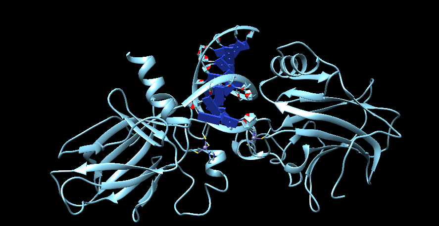
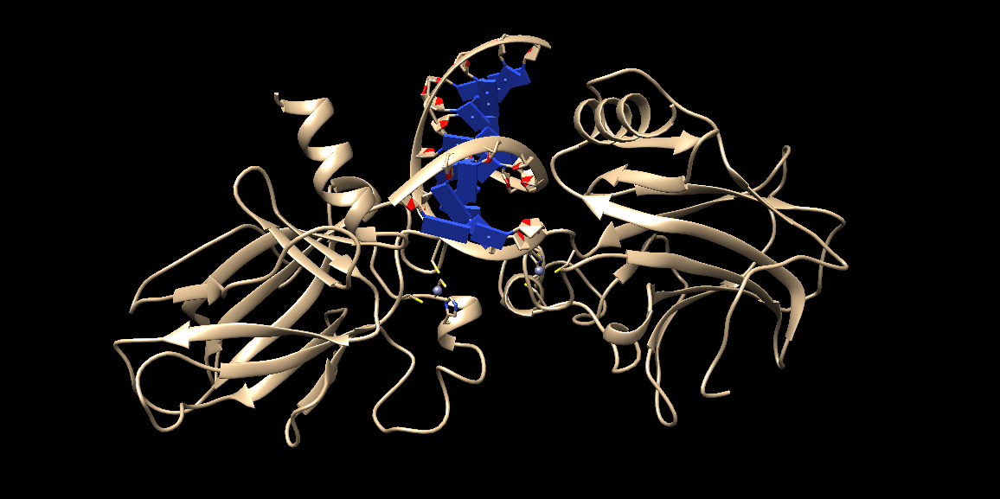
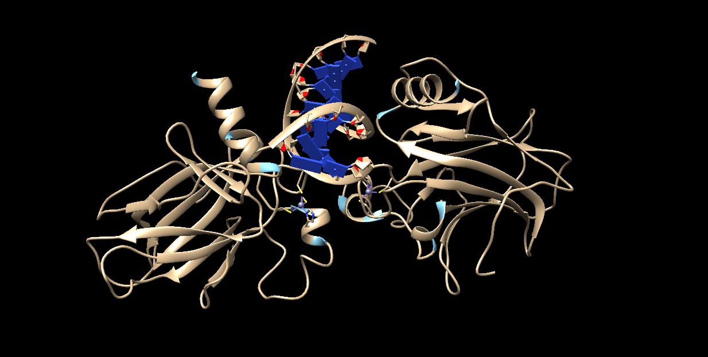

<!--<div style="text-align: justify">-->
# sbi-project

## Index
<!-- TOC depthFrom:1 depthTo:6 withLinks:1 updateOnSave:1 orderedList:0 -->
- [Introduction](#Introduction)
- [Background and Scientific Explanation](#Background-and-Scientific-explanation)
- [Algorithm](#Algorithm)
- [Tutorial](#Tutorial)
- [Examples Analysis](#Examples-Analysis)
- [Limitations](#limitations)
- [References](#References)
<!-- /TOC -->

## Introduction

Due to the importance of knowing the structure of protein-protein interactions (PPIs) in the cell, the goal of this project is to perform an algorithm to modulate a protein macro-complex from individual pairs of interactions using Bioinformatics resources.

## Background and Scientific Explanation

Proteins are versatile molecules that play many critical roles in the body. Individual proteins are capable of producing a large variety of protein complexes, or even complexes with other molecules, such as DNA, that allow them to perform their function. Proteins with more than one polypeptide chain form complexes. These complexes are known as the quaternary structures of proteins. The importance of knowing the structure of these complexes is because it modulates the biological activity of the protein and the separation of the subunits often leads to the loss of functionality. It refers to the spatial arrangement of these chains as well as any interactions among them, be they covalent or non-covalent.

Experimentally determining the full structure of a protein complex or quaternary structure is very costly and time-consuming. Therefore, it is essential to develop computational techniques that combine the experimental information and the data obtained from high-throughput methods which can correctly model the protein complexes.

To be able to establish these macrocomplexes we require a starting point, composed of Protein DataBank (PDB) files which feature experimentally determined structures. In our case, these structures are the combination of chains within our complex. As mentioned, experimentally determining the structure of a complex is problematic and so a suitable alternative is determining the physical structure of sections of the complex, i.e. the interaction between two chains within these complex, be they homo or heterodimers.

The core of our program is based on superimposition, where if we have sufficient PDB files from our complex then we can superimpose these and build a much more complex quarternary structure, modelling any interactions which the experimentally obtained PDB files may not show.

Superimposition is based on aligning two protein chain such that their carbon backbone lie one on top of the other as much as possible, where one chain is fixed and the other is rotated and translocated to minimize their separation. Though secondary structure can easily be different between distant homologues, their tertiary structure is more conserved and so homology can be more easily ascertained from this level.

In this program, we establish superimposition to implement new proteins onto the macrocomplex. If two chains have a low RMSD (root-mean-square deviation) we can determine that they are the same chain and so interactions in the individual PDB files can be combined to give a greater image of the macrocomplex.

Moreover, an accurate superimposition does not imply that a third chain is in that position. To be able to confirm whether a certain chain is a part of a macrocomplex in that location it is also important to check its surrounding chains and whether there are any steric clashes. This is the case of chains where, even though the chains superimpose correctly, the chain with which it is interacting occupies the space of a protein that is already there. This means that the interacting chains should not be placed in the complex, in that location.

>

To judge the presence of steric clashes the VanDerWaals radius is used, any atom from a different chain that is within a certain radius of an alpha carbon will be denoted as a clash. There are several non-covalent bonds found in proteins, such as hydrogen bonding, these types of interactions mean that the distance between two nuclei can be reduced. To reduce the impact of this, only the alpha carbon radii are measured since these are not able to form hydrogen bonds. Though their neighbouring atoms may be able to, this will have less of an impact on the carbon interactions.

Finally, PDB files often only have a part of the protein structure and so we can rebuild the complete quaternary structure by using the relevant amino acid sequences, from FASTA files, the build-out our model of the structure.

## Algorithm

Once we have run quality control through the input, assuring that the files introduced are either PDB or FASTA file formats we can initiate the main bulk of the algorithm. Firstly, chains from each PDB are built into their coresponding sequences (be they Protein, DNA or RNA). From here we perform a pairwise alignment in which each chain from any of the PDB files is aligned with another PDB chain from a different file. This is carried out to identify homologous chains. In our algorithm we consider homology to be sequences that have more than 95% identify. These homologous chains are set up into the pertinent structure.

Once we have our input data processed we set the starting complex. The staring complex is chosen by identifying the PDB file with the greatest number of homologous chains. By using this we aim to initiate the run with a PDB file which will the greatest number of interactions possible.

At this point the program can run two different types of algorithms depending on which the user has chosen, `simple` or `complete`.  

#### Simple
This is the default option. The program will iterate through each chain the current complex, from here on this chain will be referred to as _Chain A_, initially the current complex will be the starting complex as mentioned above. It will attempt to superimpose chains that are homologous to _Chain A_ and check for clashes in those superimpositions where RMSD is lower than other chains tested for _Chain A_. Eventually, this will return a single optimal chain to add to the complex (that with the best RMSD and is not clashing with other chains currently in the complex). With the addition of this chain to new `option_complex` will be stored and the iteration will continue, this time using the option_complex and carrying out the same procedure for the next chain within the initial complex. (XXXX make sure wording makes sense regarding initial complex XXXX) This process will continue until all the chains in the initial complex have been analysed. As many chains as there in the current complex may be added at the end of this loop. At this point the program shall check whether any end crioterion have been met. If this is the case the it shall return the final complex. If these criterion have not yet been met then the program will run the algorithm again to continue adding chains to the complex.

(XXXX ADD THAT SINCE WERE LOOPING THROUGH ALL CHAINS, AT ONE POINT MORE THAN ONE CHAIN WILL BE ADDED XXXX)

#### Complete
The functions used in this type of run are the same as those in `Simple` but with some notable procedural differences. The run will loop through any chains that may be superimposed onto the current complex. For each of these it shall check where the chain may be superimposed within the current complex, it will then search for alternatives to _Chain A_ (XXXX DEFINE CHAIN A IN THIS CASE XXXX). For each of these homologous chains it will check which chain has the best RMSD and no clashes. The chain will be added to the complex and at this point, if the end criterion have not been met, the program will run recursively again. In this way the algorithm is exhausting all possible options for the model. This type of run will produce a much larger number of models but since all options have been exhaustively tested they will have greater accuracy.


  |  

### Superimposition
For each chain that is introduced into the `superimpose` function the program checks which chains are homologous to it. The program then iterates through these homologous chains and superimposes the homologous chain onto the chain that was introduced into the function. onsidering a default RMSD threshold of 0.5 the returned RMSD is evaluated to consider whether it is lower than the RMSD from previously tested homologous chains. If RMSD is lower then the program will go on to check for clashes.

### Steric Clashes
Steric clashes are checked using the `Complex` class function `is_clashing`. The function requires the chain that is being considered as an addition to the complex (i.e. the interacting chain from the superimposed chain). A list of alpha carbons is produced for both the chain we are testing and the current model. With these it is checked whether any of the chains alpha carbons are within a 1.7 armstrong (XXXX) radius of the alpha carbons from the current complex. If there are (XXXX) 3% of atoms within this radius then the chain is returned to the `Superimpose` function as `True` (i.e. the chain is clashing). If there are fewer clashes than this threshold then the chain is considered not clashing.

## Examples Analysis

In this section can be found an analysis of the complexes built using Macrocomplex builder and the necessary commands to build them using the files in the `example` folder. In addition, there is a discussion of how the program performs in terms of running time and complex quality.

In the images, the <span style="color:cyan;"> **Blue Complex**</span> is the original complex and the <span style="color:#FBDAB0;"> **Beige Complex** </span> is the build complex. 

### Example 1, 4g83
This PDB entry corresponds to the crystal structure of p73 DNA-Binding domain tetramer from Homo Sapiens, bound to a full response-element, [4g83](https://www.rcsb.org/structure/4g83). This entry is formed by 1 unique protein chain and 1 unique nucleic acid chain. 

XXXXXXXXXXXXXX i dont understand pdb data base, it put that but also put that stech is A4, and that there is A,B proteins chain --> we have to discuss who we want to do the examples. XXXXXXXXXXXXXX

  

As can be seen, the model built fits perfectly with the original complex, there is no differences between them. So the program has no problem dealing with this type of interactions. This model was built in the simplest way, without any stoichiometry or number of chains. 


 ```bash
 $ scr/macrocomplex_builder.py -i example/4g83/ -o Macro_4g83.pdb
 ```


## Limitations

###### 1. Simple run outputs only one model

Since the simple run type only adds the interaction with the best RMSD this will create a single model in which the best superimpositions have been added. This poses the issue that a seperate chain, with a greater RMSD, may be better suited in that position.

###### 2. Complete run outputs many models

There is currently not a method for selecting the optimum model when running the `--complete` option meaning that many models are created and the user must decide which is the optimal model. Ideally, a function would be implemented to analyze the final `Complex` objects and rank them according to the likelihood that they are the actual model. We believe ranking would be optimal over returning a single model since complexes may have different conformations.

###### 3. Complete run exhausts all possibilities

Though this is one of the main advantages of this type of run it also presents the impediment that structures which are not biologically concordant must be constructed (such as large hydrophobic areas being present at the interface of the protein).

###### 4. Computational cost

Since the `--complete` option is a complete recursive algorithm the computational cost is exponential, such that currently it can only handle small complexes. Eventually a marker could be implemented so that any combination that has previously tested (with exactly the same chains and interactions surrounding it) and was deemed to clash will not be repeated, thus reducing the number of processes that need to be carried out

###### 5. Cannot process small molecules
Currently the program will not introduce any interactions involving small molecules.

(XXXX Añadir algo mas? XXXX)


###### 6. No secondary structure modelling
As long as the PDB files contain the full chain structure the model of the macrocomplex will be produced, in the case that the file only contains a fragment of an interaction or chain the program will not model the remaining structure. This could be implemented if the relevant FASTA files are available, using resources such as `MODELLER` the missing sections could be modeled combing the interaction from the pdb and the predicted secondary structure created from the full protein sequence.

<!--</div>-->
